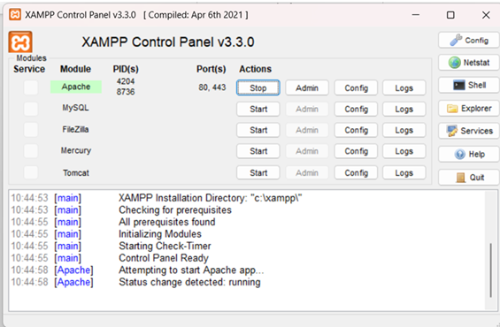
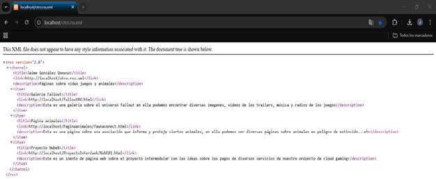
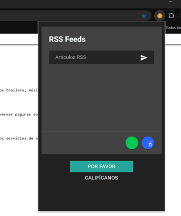
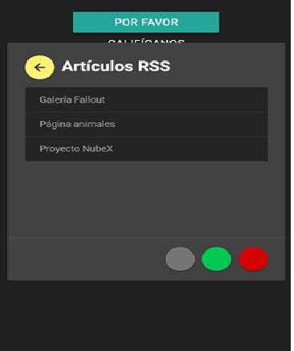
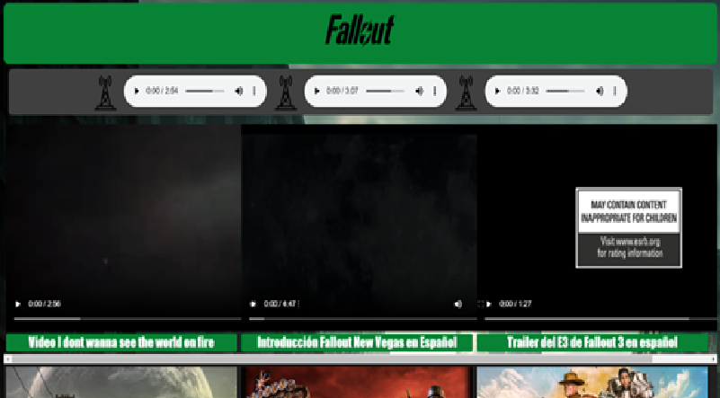
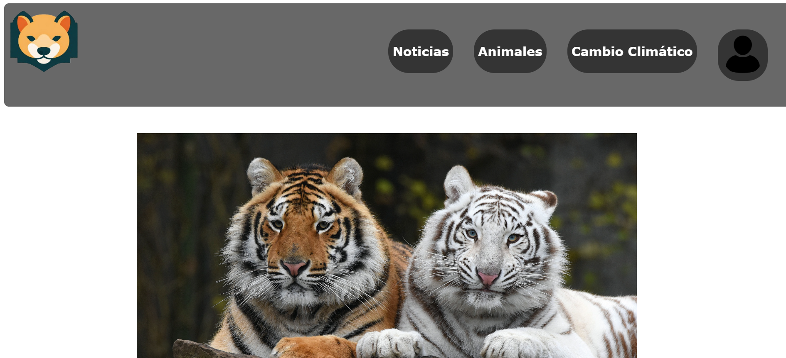
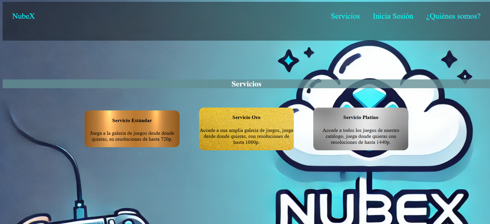

# Primero arrancamos el servicio apache dentro de xamp

# Segundo paso:
 Escribimos en nuestro navegador locahost/otro.rss.xml (el nombre del archivo de nuestro rss)
 Hemos hecho una página XML donde tenemos los RSS\
\
Este archivo lo hemos guardado en la carpeta hdocs de la carpeta raíz del programa xamp, en este archivo xml podemos observar un canal principal que se llama Jaime, al cual se enlaza este xml. Dentro del canal principal tenemos varios ítems, estos son las páginas web enlazadas, tenemos el titulo, el enlace al archivo local dentro de la carpeta hdocs y una pequeña descripción.

# Tercer paso: 
Una vez abrimos está pagina con nuestro navegador web donde tenemos instalado nuestro lector de rss\
\

Abrimos el lector de rss, en nuestro caso en el botón donde aparece una ñ podremos añadir distintos rss, agregando un título, una descripción y un enlace al sitio web. Nosotros ya lo tenemos añadido\

# Cuarto paso:
Si pulsamos en el rss podremos observar lo anteriormente mencionado, los diferentes sitios web de nuestro artículo, cada uno de ellos con un nombre que hemos especificado en el xml y el enlace también especificado en el xml. Si pulsamos cualquiera de ellos podemos ver que funcionan\
\

# Quinto paso:
Podemos ir pulsando en los diferentes articulos y observar las diferentes páginas\
## Galería de fallout:

## Página sobre ánimales:

## Página sobre NubEX:

